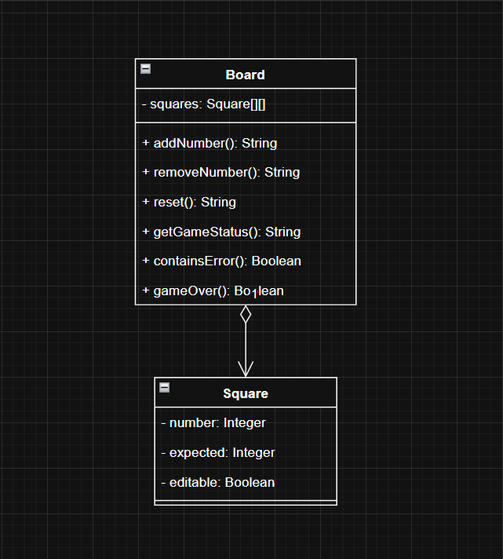

# PROJETO SUDOKU

Esse é um dos projetos que desenvolvemos ao longo de um dos módulos do Bootcamp Santander da DIO, mais especificamente na trilha JAVA. É um jogo de Sudoku básico onde o usuário pode inserir e remover números do tabuleiro até completá-lo com os requisitos necessários.

## Requisitos
- 🍵 Java JDK 17 (ou superior)
- 🪶 Maven para gerenciamento de dependências
- ⚙️ Atualização dos argumentos para construção de novos tabuleiros

## Conceitos aplicados 🧩
- Manipulação de listas
- Stream API
- Manipulação de Strings
- Conceito de abstração da POO
- Tratamento de entradas do usuário

## Funcionalidades 🧰
- 👀 Visão geral do tabuleiro com sua situação atual
- 🔎 Verificação da situação atual do jogo (com exibição de coluna/linha que estejam com erros)
- ➕ Adição de números (se o campo for editável e não tiver números)
- ❌ Remoção de número inserido (se o campo for editável e não for nulo)
- 🔄️ Reset de todos os campos alterados

## Diagrama básico

    

